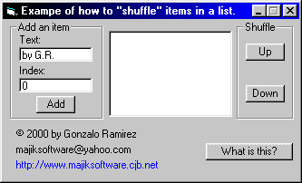



## Shuffle/Rearrange Items in a listbox\.

### Description

Demonstrates how to add an item to a listbox in any desired index. (i.e. Add an item between the 2nd and 3rd item in a listbox.)

Demonstrates how to shuffle/rearrange items in a listobx (i.e. Moving an item "up" or "down" the list at runtime).
 
### More Info
 
String to add to a listbox.

Index to determine where the new item will be added.

This was coded in VB6 and works with VB5. I don't believe it will open in VB4, much less VB3, but the codeing concept should work with those versions.

Item added to the specified location.

[none]

             |
---                |---
**Submitted On**   |2000-06-19 14:20:50
**By**             |[Gonzalo Ramirez](https://github.com/Planet-Source-Code/PSCIndex/blob/master/ByAuthor/gonzalo-ramirez.md)
**Level**          |Intermediate
**User Rating**    |5.0 (25 globes from 5 users)
**Compatibility**  |VB 4\.0 \(32\-bit\), VB 5\.0, VB 6\.0
**Category**       |[String Manipulation](https://github.com/Planet-Source-Code/PSCIndex/blob/master/ByCategory/string-manipulation__1-5.md)
**World**          |[Visual Basic](https://github.com/Planet-Source-Code/PSCIndex/blob/master/ByWorld/visual-basic.md)
**Archive File**   |[CODE\_UPLOAD69076192000\.zip](https://github.com/Planet-Source-Code/gonzalo-ramirez-shuffle-rearrange-items-in-a-listbox__1-9051/archive/master.zip)

### API Declarations

[none]

